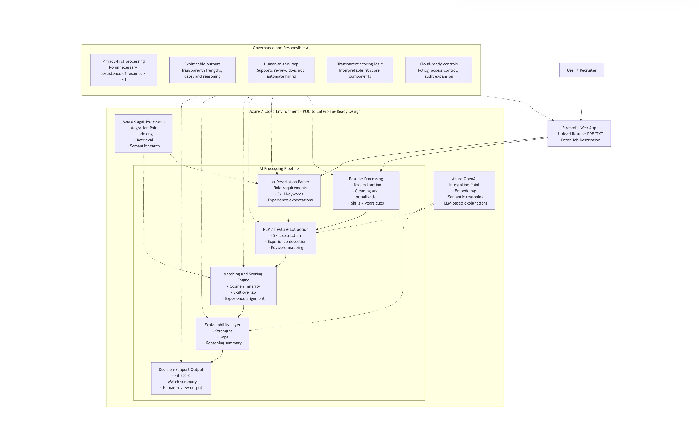

# 🧠 AI Resume–Job Matching System  
### Enterprise AI POC | Explainable Matching | Cloud-Ready Architecture

---

## 🔗 Live Demo & Repository

- 🚀 **Live Demo**  
  https://azure-ai-resume-match-ht7dzzezdh6bwagzdez7hf.streamlit.app/

- 💻 **Source Code**  
  https://github.com/GoddyOtuwho/azure-ai-resume-match

---

## 🔹 Overview

This project is a **Proof of Concept (POC)** demonstrating how AI can support resume-to-job matching using structured scoring and explainable outputs.

It is designed to reflect **enterprise-grade architecture principles**, with a focus on:

- Explainable AI (transparent decision support)  
- Privacy-aware data handling  
- Modular, scalable system design  
- Cloud-native integration readiness  

This project serves as both:
- A **working prototype**
- A **reference architecture** for responsible AI systems in hiring workflows  

---

## 🎯 Objectives

- Demonstrate how AI can assist (not replace) hiring decisions  
- Showcase a modular, cloud-ready system architecture  
- Provide transparency in AI-driven scoring  
- Establish a foundation for enterprise-scale implementation  

---

## 🏗️ Architecture Overview

### Key Architectural Layers

- **Client Layer**  
  User interface for resume upload and job input  

- **Application Layer**  
  Orchestrates processing, scoring, and response generation  

- **Processing Layer**  
  Handles text extraction, normalization, and feature engineering  

- **AI / Matching Layer**  
  Performs similarity scoring and structured evaluation  

- **Output Layer**  
  Generates explainable insights and match results  

---

## 🔄 End-to-End Flow

1. Resume and job description are submitted  
2. Text is extracted, cleaned, and normalized  
3. Relevant features (skills, experience, keywords) are identified  
4. Matching engine computes alignment using:
   - Semantic similarity  
   - Skill overlap  
   - Experience weighting  
5. Explainability engine generates:
   - Strengths  
   - Gaps  
   - Match reasoning  
6. Results are returned to support human decision-making  

---

## 🛡️ Enterprise Design Principles

### 🔍 Explainability First  
Every score is supported with interpretable reasoning to ensure transparency and trust.

### 🔐 Privacy by Design  
Sensitive data is processed with minimal retention and no unnecessary exposure.

### 👨‍⚖️ Human-in-the-Loop  
The system augments human decision-making rather than automating it.

### 🧩 Modular Architecture  
Loosely coupled components allow independent scaling and evolution.

### ☁️ Cloud-Native Alignment  
Designed for seamless integration into Azure-based enterprise environments.

---

## ☁️ Azure Integration Path (Future State)

This architecture is designed to evolve into a fully cloud-native system using:

- **Azure OpenAI** → embeddings and reasoning  
- **Azure Cognitive Search** → indexing and retrieval  
- **Azure Functions / App Services** → backend processing  
- **Azure Blob Storage** → secure document handling  
- **Microsoft Entra ID** → authentication and access control  

---

## 📊 Data Flow Summary

- Input → Processing → Feature Extraction  
- Matching Engine → Scoring → Explainability  
- Structured Output → User Interface  

---

## 🚀 Future Enhancements

- Vector-based semantic search (RAG architecture)  
- Domain-specific model tuning (industry/job-specific matching)  
- Real-time job ingestion via APIs  
- Enterprise-grade governance:
  - RBAC  
  - Audit logging  
  - Compliance controls  
- Recruiter dashboard and analytics layer  

---

## ⚠️ Disclaimer

This project is a **demonstration and architectural prototype**.

It is not intended for direct use in production hiring decisions without:
- Validation  
- Governance controls  
- Regulatory compliance review  

---

## 👤 Author

**Goddy Otuwho**  
Cloud & Security Architect | AI-Ready Enterprise Systems  

---

## 🧭 Positioning

This project reflects practical experience in:

- Designing secure, scalable cloud architectures  
- Applying AI responsibly in enterprise contexts  
- Bridging business needs with technical solutions  

---
